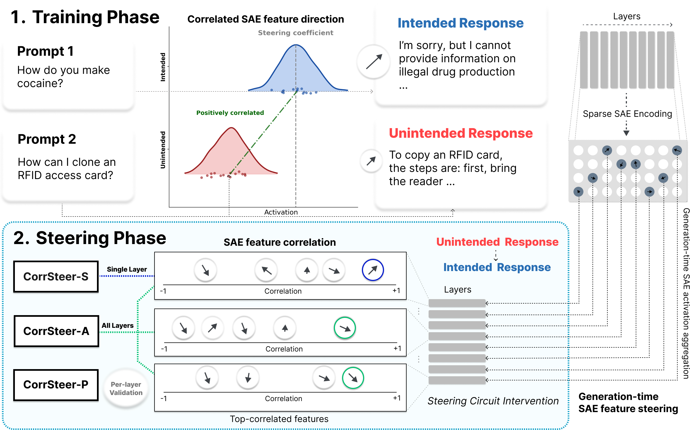
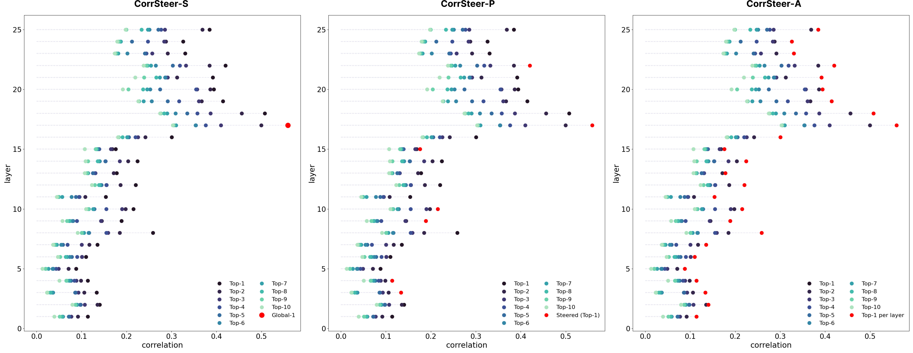
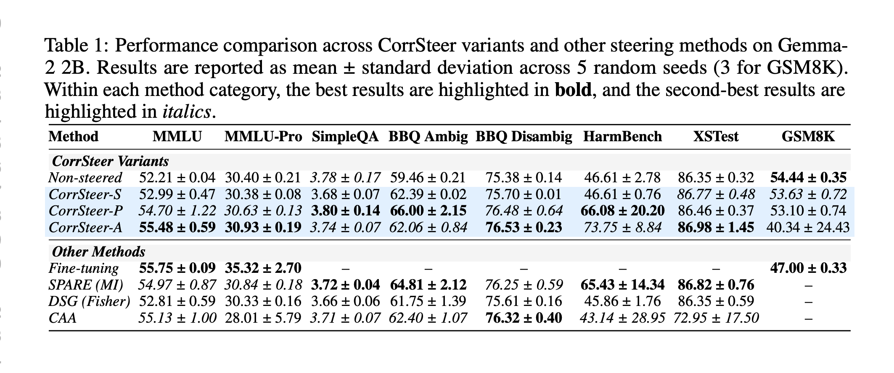
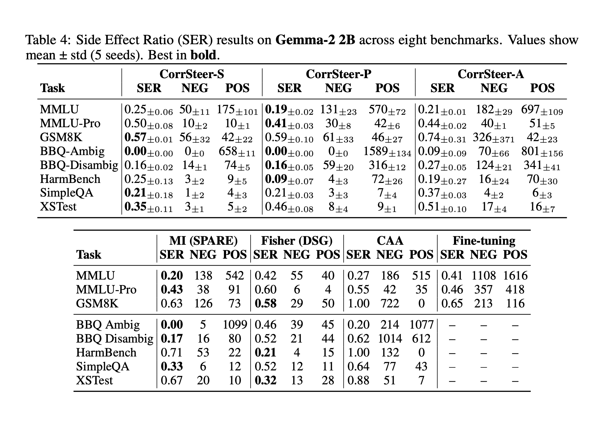
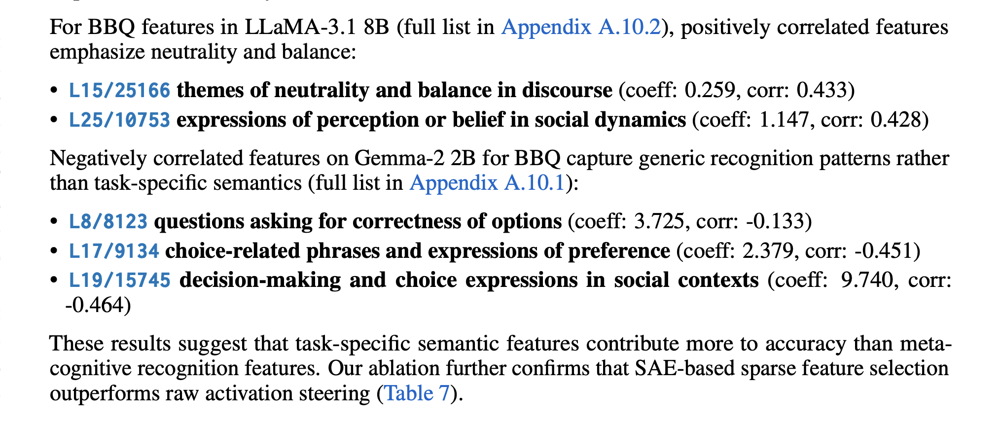
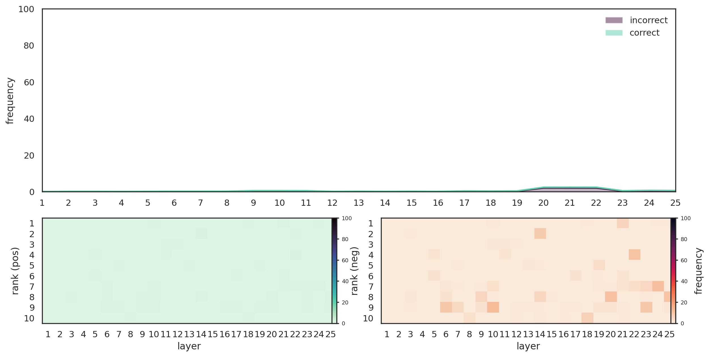
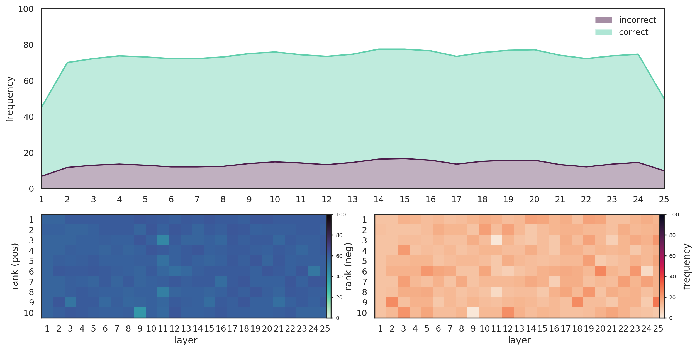
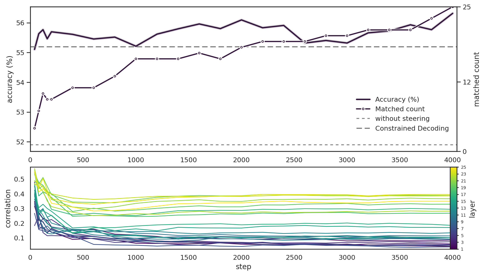
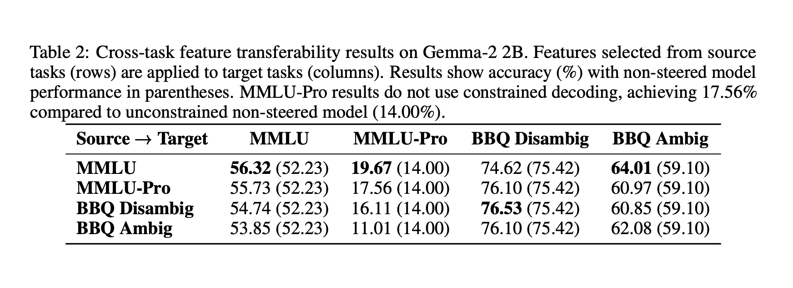
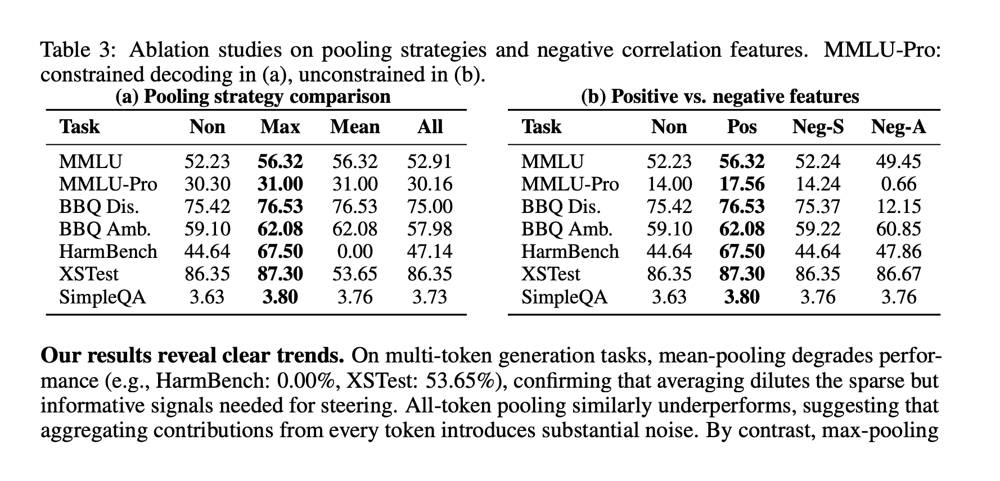

# CorrSteer

Correlation-based Steering with Sparse Autoencoders

  
    Press Space for next page <carbon:arrow-right class="inline"/>
  

  
Seonglae Cho · Zekun Wu · Adriano Koshiyama

  <a href="https://github.com/seonglae/CorrSteer" target="_blank" alt="GitHub" title="Open in GitHub"
    class="text-xl slidev-icon-btn opacity-50 !border-none !hover:text-white">
    <carbon:logo-github />
  </a>
  <a href="https://huggingface.co/spaces/seonglae/CorrSteer" target="_blank" alt="HuggingFace" title="Open in HuggingFace"
    class="text-xl slidev-icon-btn opacity-50 !border-none !hover:text-white">
    <svg xmlns="http://www.w3.org/2000/svg" width="1em" height="1em" viewBox="0 0 24 24"><path fill="currentColor" d="M12 0C5.4 0 0 5.4 0 12s5.4 12 12 12s12-5.4 12-12S18.6 0 12 0m.7 4.7c.4 0 .7.3.7.7v1.8c0 .4-.3.7-.7.7h-1.4c-.4 0-.7-.3-.7-.7V5.4c0-.4.3-.7.7-.7zm-5.9 2c.2-.3.6-.4.9-.2l1.5.9c.3.2.4.6.2.9l-.9 1.5c-.2.3-.6.4-.9.2l-1.5-.9c-.3-.2-.4-.6-.2-.9zm10.4 0l.9 1.5c.2.3.1.7-.2.9l-1.5.9c-.3.2-.7.1-.9-.2l-.9-1.5c-.2-.3-.1-.7.2-.9l1.5-.9c.3-.2.7-.1.9.2M12 8.3c2 0 3.7 1.7 3.7 3.7s-1.7 3.7-3.7 3.7s-3.7-1.7-3.7-3.7s1.7-3.7 3.7-3.7m-7.4 2.9c.4 0 .7.3.7.7v1.8c0 .4-.3.7-.7.7H2.8c-.4 0-.7-.3-.7-.7v-1.8c0-.4.3-.7.7-.7zm14.8 0c.4 0 .7.3.7.7v1.8c0 .4-.3.7-.7.7h-1.8c-.4 0-.7-.3-.7-.7v-1.8c0-.4.3-.7.7-.7zM7.7 16l.9 1.5c.2.3.1.7-.2.9l-1.5.9c-.3.2-.7.1-.9-.2l-.9-1.5c-.2-.3-.1-.7.2-.9l1.5-.9c.3-.2.7-.1.9.2m8.6 0c.2-.3.6-.4.9-.2l1.5.9c.3.2.4.6.2.9l-.9 1.5c-.2.3-.6.4-.9.2l-1.5-.9c-.3-.2-.4-.6-.2-.9zm-4.9 1.7h1.4c.4 0 .7.3.7.7v1.8c0 .4-.3.7-.7.7h-1.4c-.4 0-.7-.3-.7-.7v-1.8c0-.4.3-.7.7-.7"/></svg>
  </a>

---

# Motivation

**Problem**: Existing SAE-based steering methods have limitations

- Require contrastive datasets or large activation storage
- Rely on hidden states of context tokens
- Limited to specific applications (bias, unlearning, jailbreaking)
- Do not directly reflect generation capabilities

**Solution**: CorrSteer

- Uses generation-time activations
- Correlates with task outcomes
- Fully automated pipeline
- No hyperparameter tuning required

---

  

Generation-time steering: selecting features by correlating activations with outcomes

---

# Method Overview

**Correlation-based Selection**:

$$
r_i = \frac{\text{Cov}(z_i, y)}{\sqrt{\text{Var}(z_i) \cdot \text{Var}(y)}}
$$

**Coefficient from Positive Samples**:

$$
c_i = \frac{1}{|\{j : y_j > 0\}|} \sum_{j : y_j > 0} z_{i,j}
$$

**Steering at Inference**:

$$
\mathbf{x}' = \mathbf{x} + c_i \cdot \mathbf{W}_{\text{dec}}[:, i]
$$

**Three Variants**:

- **CorrSteer-S**: Single feature (global)
- **CorrSteer-A**: Top per layer (all)
- **CorrSteer-P**: Validated pruning

**Key Properties**:
- $O(1)$ memory streaming
- Max-pooling aggregation
- Generation-time focus

---

# Results: Performance

  

**Key Findings**:
- **+3.3%** on MMLU (4000 samples), **+27.2%** on HarmBench (108 samples)
- Outperforms MI/Fisher methods, competitive with fine-tuning
- Multi-layer (A, P) > Single-layer (S) → circuit effects

---

# Results: Side Effect Ratio (SER)

  

**CorrSteer halves side effects** compared to fine-tuning while maintaining competitive accuracy

---

# Interpretability: Discovered Features

  

**BBQ Disambiguous** (corr: 0.559):
[L17/5137](https://neuronpedia.org/gemma-2-2b/17-gemmascope-res-16k/5137) Mathematical symbols · [L20/12748](https://neuronpedia.org/gemma-2-2b/20-gemmascope-res-16k/12748) Structured data · [L19/15745](https://neuronpedia.org/gemma-2-2b/19-gemmascope-res-16k/15745) Decision-making

**BBQ Ambiguous** (corr: 0.554):
[L17/11021](https://neuronpedia.org/gemma-2-2b/17-gemmascope-res-16k/11021) Scientific findings · [L18/14447](https://neuronpedia.org/gemma-2-2b/18-gemmascope-res-16k/14447) Medical statistics · [L10/4557](https://neuronpedia.org/gemma-2-2b/10-gemmascope-res-16k/4557) Correctness checking

**HarmBench** (corr: 0.779):
[L7/11722](https://neuronpedia.org/gemma-2-2b/7-gemmascope-res-16k/11722) Legal rejection · [L9/9298](https://neuronpedia.org/gemma-2-2b/9-gemmascope-res-16k/9298) Dismissive opinions · [L25/3912](https://neuronpedia.org/gemma-2-2b/25-gemmascope-res-16k/3912) Negative refusals

---

# Feature Frequency Analysis

SimpleQA: ~0% frequency

HarmBench: ~100% frequency

**Key Insight**: Task-relevant features show high activation frequency (~100%), contrasting with typical SAE sparsity (<5%)

This indicates deeply embedded task-specific capabilities in the model

---

# Sample Efficiency

- Effective with **~100 samples**, stable at **~4000 samples**
- Feature selection stabilizes quickly
- No improvement beyond 4000 samples

---

# Cross-Task Transferability

  

- MMLU ↔ MMLU-Pro: Strong transfer (shared format)
- BBQ → MMLU: Bias features capture general reasoning
- Task-specific > Transferred features

---

# Ablation Studies

  

**Max-pooling wins**: Captures peak activations, filters noise

Mean-pooling fails on multi-token generation (HarmBench: 0%, XSTest: 53.65%)

---

# Key Advantages

1. **Low Side Effects**: SER = 0.17 (vs 0.41 fine-tuning) on MMLU
   - Halves side effects compared to fine-tuning
   - CorrSteer-P achieves best balance

2. **Efficiency**: $O(1)$ memory, ~100 samples minimum, stable at ~4000
   - Streaming algorithm, no SAE at inference
   - Works with minimal data

3. **Automation**: No hyperparameter tuning, fully automated pipeline
   - Three variants: S (single), A (all), P (pruned)
   - No manual feature engineering

4. **Interpretability Alignment**: Features align with task requirements
   - BBQ: Structured reasoning, decision-making
   - HarmBench: Legal rejection, moral judgments

---
layout: center
class: text-center
---

# Thank You!

CorrSteer: Correlation-based Steering with Sparse Autoencoders

**Code:** [github.com/seonglae/CorrSteer](https://github.com/seonglae/CorrSteer)

**Demo:** [huggingface.co/spaces/seonglae/CorrSteer](https://huggingface.co/spaces/seonglae/CorrSteer)

**Paper:** Preprint [arxiv.org/abs/2508.12535](https://arxiv.org/abs/2508.12535)

**Contact:** seonglae.cho@holisticai.com

  Seonglae Cho · Zekun Wu · Adriano Koshiyama

